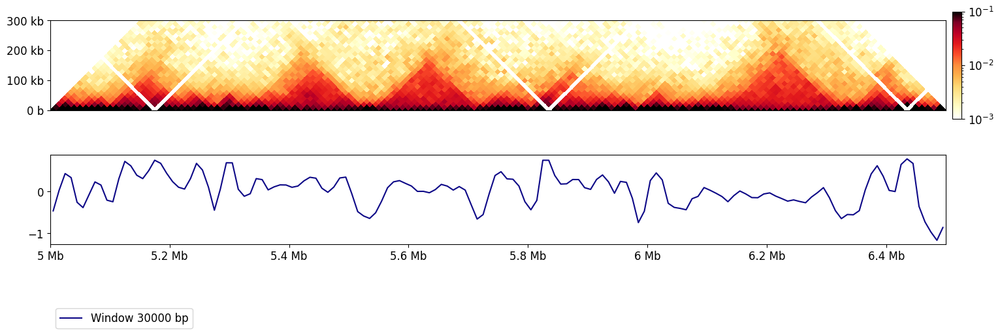
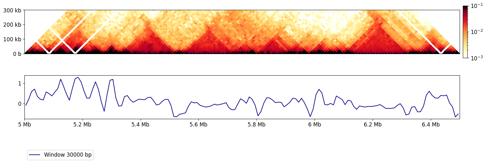
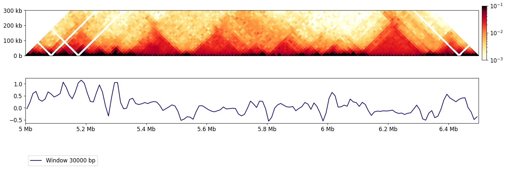
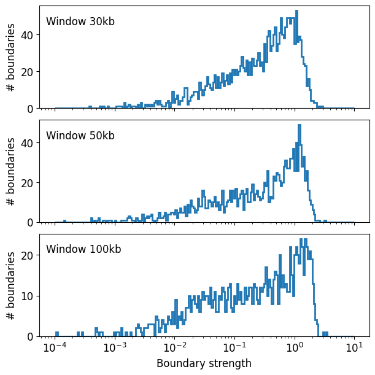
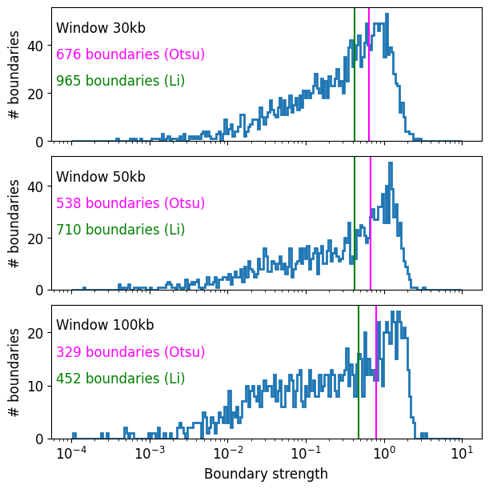

# hse_hw4_hic

## Выбранная хромосома: chr2L 5 000 000 - 6 500 000

## Colab: https://colab.research.google.com/drive/1LxsoiF_Ixo15yGL2eLQrPe4AOEFgWZFd?usp=sharing

## Задачи:
- Получить информацию и атрибуты матрицы Hi-C с помощью cooler.info (папка data/cooler_infos)
- Открыть объект cooler как сбалансированную матрицу для внутрихромосомных контактов (отчет в Colab Notebook)
- Получить таблицу с координатами и контактами, они сбалансированные или нет? (отчет в Colab Notebook)
- Получить таблицу в командной строке командой *cooler dump* (папка data/cooler_dumps)
- Посмотрите таблицу с бинами, какие столбцы там присутствуют?
- Постройте кривые зависимости число контактов от расстояния для выбранной хромосомы (в логарифмических-координатах) для 4х реплик. Сравните их.

- Для выбранного участка найдите insulation score и границы тадов для всех реплик

- Сравните результаты и постройте графики полученных кривых. Отобразите на них границы  ТАДов.

